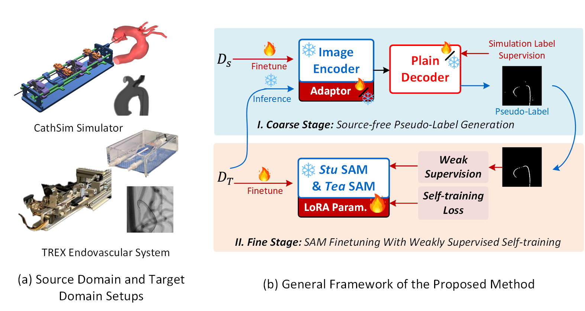
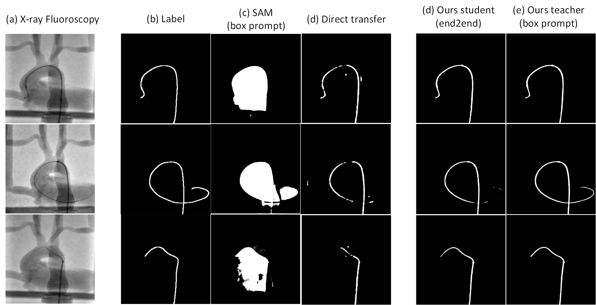

<div align="center">

<h2> Generalizing Segmentation Foundation Model Under Sim-to-real Domain-shift for Guidewire Segmentation in X-ray Fluoroscopy

<a href='https://github.com/Yuxuan-Wen/Sim2real-Guidewire-Seg'></a> 
<a href='http://arxiv.org/abs/'></a> 

</div>


[Yuxuan Wen](https://github.com/Yuxuan-Wen)<sup>1,</sup><sup>2</sup>, [Evgenia Roussinova](https://www.researchgate.net/profile/Evgenia-Roussinova-2)<sup>2,</sup><sup>3</sup>, 
[Olivier Brina](https://www.researchgate.net/profile/Olivier-Brina)<sup>5</sup>, [Paolo Machi](https://scholar.google.com/citations?user=8TpxR0IAAAAJ&hl=it)<sup>5,</sup><sup>6</sup>, and [Mohamed Bouri](https://scholar.google.ch/citations?user=NjhGHu0AAAAJ&hl=fr) <sup>2,</sup><sup>3,</sup><sup>4</sup>

<sup>1 </sup>Dep of EECS, University of Cincinnati; <sup>2 </sup>REHAssist, EPFL; <sup>3 </sup> TNE, EPFL; <sup>4 </sup> BioRob, EPFL; <sup>5 </sup> Dep of Interventional Neurora-diology, Geneva University Hospital; <sup>6 </sup> Brain Endovascular Therapeutics R&D Lab, Campus Biotech Geneva.

## News

[2024.8.27]: The first version of implementation for "Generalizing Segmentation Foundation Model Under Sim-to-real Domain-shift for Guidewire Segmentation in X-ray Fluoroscopy" is released.

## Introduction



Our method generalizes an end-to-end vision foundation model for application in real-world X-ray fluoroscopy, eliminating the need for manual annotations in the target domain.


## Environmental Setups

### Requirements
- Linux or macOS with Python ≥ 3.8
- PyTorch ≥ 1.13.1 and [torchvision](https://github.com/pytorch/vision/) that matches the PyTorch installation.
- Install pytorch [lightning](https://lightning.ai/pytorch-lightning) that matches the PyTorch installation.
- `pip install -r requirements.txt`


### Example conda environment setup
```bash
conda create --name sim_to_real python=3.8
conda activate sim_to_real

# CUDA 11.7
conda install pytorch==2.0.1 torchvision==0.15.2 torchaudio==2.0.2 pytorch-cuda=11.7 -c pytorch -c nvidia

git clone https://github.com/zhang-haojie/wesam.git
cd wesam
pip install -r requirements.txt
```

## Data Preparation

### Download Dataset

**For the publicly available Phantom Dataset**
The dataset provided in [Catheter segmentation in X-ray fluoroscopy using synthetic data and transfer learning with light U-nets](https://www.sciencedirect.com/science/article/pii/S0169260719312301?ref=pdf_download&fr=RR-2&rr=8b859942795d9129) is used. You can download scenes from [Phantom Dataset](https://www.ucl.ac.uk/interventional-surgical-sciences/weiss-open-research/weiss-open-data-server/catheter-segmentation-data) and process the data follow their script and instructions. 

### Prepare

The dataset should be organized as this structure:
```
-fine_stage
    ├── data (e.g. Phantom Dataset)
    │   | synthesized 
    │     ├── image
    │     ├── mask 
    │   | real
    │     ├── image
    │         ├── 0000.png
    │         ├── 0001.png
    │         ├── 0002.png
    │         ├── ...

-coarse_stage
    ├── data (e.g. Phantom Dataset)
    │   | train
    │     ├── sim
    │       ├── image
    │       ├── mask
    │     ├── real
    │       ├── image
    │       ├── mask (For validation)
    │   | test
    │     ├── sim
    │       ├── image
    │       ├── mask
    │     ├── real
    │       ├── image
    │       ├── mask (For validation)

```

### Download SAM Checkpoints

Click the links below to download the checkpoint for the corresponding model type. In all of our experiences, we adopt vit_b if otherwise stated.

- `vit_h`: [ViT-H SAM model.](https://dl.fbaipublicfiles.com/segment_anything/sam_vit_h_4b8939.pth)
- `vit_l`: [ViT-L SAM model.](https://dl.fbaipublicfiles.com/segment_anything/sam_vit_l_0b3195.pth)
- `vit_b`: [ViT-B SAM model.](https://dl.fbaipublicfiles.com/segment_anything/sam_vit_b_01ec64.pth)


## Training


### Coarse Stage
```
# 0 (optional) add target-sepcific gaussian noise (default: random noise)
change FullAugmentor in .$BASE DIR$/coarse_stage/transform.py

# 1 train SAM with sythesized image
python coarse_stage_train.py \
    --img_path_synthesized $SYNTHESIZED IMAGE PATH$ \
    --mask_path_synthesized $SYNTHESIZED MASK PATH$ \
    --checkpoint "./$PATH_TO_SAM_CHECKPOINT$/sam_vit_b_01ec64.pth" \
    --save_path SAVE PATH$ \
    --epoch $EPOCH NUMBER$ \
    --device $DEVICE IDs$ \
    --$... ADDITIONAL ARGUMENTS$

# 2 pseudo-label generation
python gen_pseudo_label.py \
    --image $TARGET DOMAIN IMAGE PATH$
    --checkpoint $YOUR TRAINED WEIGHTS$
    --batch_size $BATCH SIZE$
    --$... ADDITIONAL ARGUMENTS$
```

### Fine Stage
```
# 1 modify configs/config.py to fit your data

# 2 (Optional) train with your own data
specify the dir in $BASE$/fine_stage/configs/base_config.py
create a new $YOUR DATASET.py$ in $BASE$/fine_stage/datasets

# 3 train the student-teacher network
python train_stu_tea.py
```

## Checkpoints

We share our checkpoints for both the  

- `Coarse Stage`: [Coarse Stage SAM (vitb)](https://drive.google.com/file/d/1hS0Zv0S-frJBT3ImcqAN3aiLptYTkhbD/view?usp=drive_link)
- `Fine Stage (Phantom Dataset)`: [Fine Stage Student SAM Model Phantom Dataset (vitb)](https://drive.google.com/file/d/1Vtm9X4sdruWPPqMCxqhqqEWm_sqyjbbv/view?usp=drive_link)
- `FIne Stage (HUG Dataset)`: [FIne Stage Student SAM Model HUG Dataset (vitb)](https://drive.google.com/file/d/1Oi4kFfgBhlaDKufcoM_lqUq-QIT_h0l6/view?usp=drive_link)


## Visualization



## Acknowledgement

**This project is still under development. Please feel free to raise issues or submit pull requests to contribute to our codebase.**

Some source code of ours is borrowed from:

- [SAM](https://github.com/facebookresearch/segment-anything)

- [WeSAM](https://github.com/zhang-haojie/wesam)

- [Learnable Ophthalmology SAM](https://github.com/Qsingle/LearnablePromptSAM)

- [SAM-LoRA](https://github.com/JamesQFreeman/Sam_LoRA)

## Citation

If you find this project useful in your research, please consider cite:

```BibTeX
@inproceedings{,
  title={},
  author={},
  booktitle={},
  pages={},
  year={2024}
}
```
# Sim2real-Guidewire-Seg
